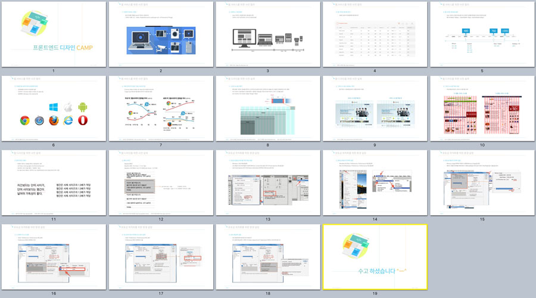

###### Front-End Design CAMP

# DAY01

### [**프론트엔드 디자인 CAMP by 정인영 프론트엔드 디자이너**](../Resources/DAY01_Overview__Keynote_by_JIY.pdf)



#### 1. 웹 서비스를 위한 사전 협의

1. 다양한 디바이스 환경
1. 디바이스 지원 범위
1. 웹디자인 중단점 찾기
1. 웹디자인 중단점 설정
1. 다양한 웹브라우저와 운영체제 환경
1. 지원 브라우저 설정(크로스 브라우징)

#### 2. 웹 서비스를 위한 사전 설계

1. 그리드 시스템이란?
1. 그리드 시스템 사용하는 목적
1. 그리드 시스템 적용 사례
1. 웹 타이포그래피
1. 베이스라인
1. 지원 브라우저 설정(크로스 브라우징)

#### 3. 포토샵 최적화를 위한 환경 설정

1. 포토샵 효율성 체크를 위한 패널 설정
1. 포토샵 메모리 최적화 설정
1. 스크래치 디스크 설정
1. 히스토리/캐시 최적화, 히스토리 설정
1. GPU 활성화 설정

-

### HTML5 문서 구조화(Markup Design)

#### 1. HTML5 문서 기본 골격

```html
<!DOCTYPE html>
<html lang="ko-KR">
<head>
  <meta charset="UTF-8">
  <title>웹 기초(기본기) 다지기</title>
</head>
<body>
</body>
</html>
```

#### 2. HTML5 주석

```html
<!-- HTML 주석: Comment -->
```

#### 3. HTML5 단락(Paragraph)

```html
<!-- HTML 단락: Paragraph -->

<p>반가운 얼굴도 등장한다. 닥터 스트레인지를 기다리는 셜록 팬들을 또 한 번 환호하게 했을 마틴 프리먼의 등장은 꽤 신선하다. 정부와 히어로들 사이에서 어떤 역할을 해줄지 살짝 기대가 되기도. 새로운 얼굴도 있다.</p>

<p>고양이를 사랑하는 이들이 한 번쯤 관심 가질 블랙팬서와 역대 가장 원작 캐릭터의 성격을 잘 살려주고 있다고 생각되는 스파이더맨이 첫 등장을 하며 존재감을 확실히 굳혔다. 둘 다 솔로 영화 제작을 앞두고 있기에 더욱 관심 가는 캐릭터가 아닐 수 없는데, 굳이 따지자면 닥터 스트레인지와 각별한 관계인 스파이더맨에 더욱 기대가 실린다. 블랙팬서는 더 많은 비중으로 등장하지만, 짧게 등장한 스파이더맨에 비해 임팩트는 좀 덜한 듯했다.</p>
```

#### 4. HTML5 제목(Headings)

```html
<!-- HTML 제목: Headings -->
<!-- HTML 제목 단계(Level) 총 6단계: h1,h2,h3,h4,h5,h6 -->

<h1>당신의 꿈을 펼쳐보세요</h1>
<h2>당신의 꿈을 펼쳐보세요</h2>
<h3>당신의 꿈을 펼쳐보세요</h3>
<h4>당신의 꿈을 펼쳐보세요</h4>
<h5>당신의 꿈을 펼쳐보세요</h5>
<h6>당신의 꿈을 펼쳐보세요</h6>
```

#### 5. HTML5 목록(Lists)

```html
<!-- HTML 목록 (Lists) -->

<!-- 순서가 중요한 목록 (Ordered List) -->
<ol>
  <!-- 목록 항목(List Item) -->
  <li>머리 감기</li>
  <li>머리 말리기</li>
  <li>머리 빗기</li>
</ol>

<!-- 순서가 중요하지 목록 (Unordered List) -->
<ul>
  <li>라이터</li>
  <li>식수</li>
  <li>칼</li>
</ul>

<!-- 정의 목록 (Definition List) -->
<!-- <dl></dl> -->
<!-- 다음 시간에... -->
```


-

### 강의 진행을 위한 환경 설정

- [Editor: Sublime Text 3](http://sublimetext.com/3)
- [packagecontrol.io](http://packagecontrol.io)
- [emmet.io](http://emmet.io/)
- [Graphic Software/Editor Portable](https://drive.google.com/folderview?id=0BzHW7hS-WHhTajZ0NDJLenJkXzg&usp=drive_web#list)
