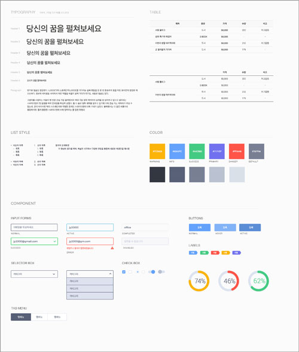

###### Front-End Design CAMP

# DAY02

## 진행 내용

- **Design for Web** 환경 분석/이해
- **UI Kit**
- **HTML5** 문서 구조화
- **Learn by Doing** 웹 타이포그래피 디자인
- **Learn by Doing** UI 컴포넌트(Components) 디자인
- **GitHub** 소셜 코딩

-

### 웹 디자인 환경 분석/이해

시스템이 기반한 디자인 방법론 [ `Typography`, `Grid System`, `Golden Ratio Rule` ]

-

### UI Kit

UI Kit의 개념은 '패턴 라이브러리', 'UI 스타일 가이드', 'UI 가이드라인' 등등 소통하는 방식은 각양각색. 어떤 단어로 소통하는 것은 중요하지 않지만 그 의미는 우리가 통일할 필요가 있다. 스타일 가이드는 웹 사이트를 만드는 이들을 위한 설명서와 재료. 디자이너, 개발자, 콘텐츠 제작자 혹은 협력업체 사람간의 소통을 위한 도구.

##### 국외 웹 스타일 가이드
- [Mozilla Sandstone](https://www.mozilla.org/en-US/styleguide/websites/sandstone/)
- [Disqus Brand & Style Guide](https://disqus.com/pages/style-guide/)
- [airbnb](https://dribbble.com/shots/1669299-Airbnb-UI-Toolkit-Web/attachments/263198)
- [Mailchimp Patterns](http://ux.mailchimp.com/patterns)
- [findguidelin.es](http://findguidelin.es/)
- [brand.uber](https://brand.uber.com/)
- [work.co](http://www.work.co/grid/)

##### 국내 웹 UI Kit
- [가비야(Gabia) 스타일 가이드](http://design.gabia.com/wordpress/?cat=12)
- [한국인터넷 진흥원 웹 스타일 가이드](http://www.kisa.or.kr/styleguide/styleguide.html)
- [인쿠프트 스타일 가이드](http://webguide.incruit.com/aboutstyleguide.asp)
- [한국 웹 스타일 가이드 모음](https://kr.pinterest.com/geunyoungkim77/%EC%9B%B9-%EC%8A%A4%ED%83%80%EC%9D%BC-%EA%B0%80%EC%9D%B4%EB%93%9C/)

##### UI Kit 도구
- [stylifyme.com](http://stylifyme.com/)
- [patternlab.io](http://patternlab.io/)
- [fbrctr.github.io](http://fbrctr.github.io/)
- [frontify.com](https://frontify.com/styleguide)
- [Style-Guide-Boilerplate](http://bjankord.github.io/Style-Guide-Boilerplate/)
- [hugeinc.github.io/styleguide](http://hugeinc.github.io/styleguide)

-

### HTML5 문서 구조화

1. 정의 목록 요소
1. 표 요소
1. 폼/폼 컨트롤 요소
1. 표현을 위한 요소 `
`, ``

-

### 웹 타이포그래피 디자인

1. **본문**
1. **제목**
1. **목록**
1. **표**

-

### UI 컴포넌트(Components) 디자인

1. **컬러**
1. **버튼**
1. **레이블**
1. **폼 컨트롤**

-

### GitHub 소셜 코딩

- [GitHub 버전 관리 도구](https://github.com/) 계정 등록
- [Github Page](https://pages.github.com/) 호스팅 등록
- [GitHub Page 도메인 네임](http://blog.saltfactory.net/github/setting-domain-name-in-github-pages-via-cname.html) 설정

