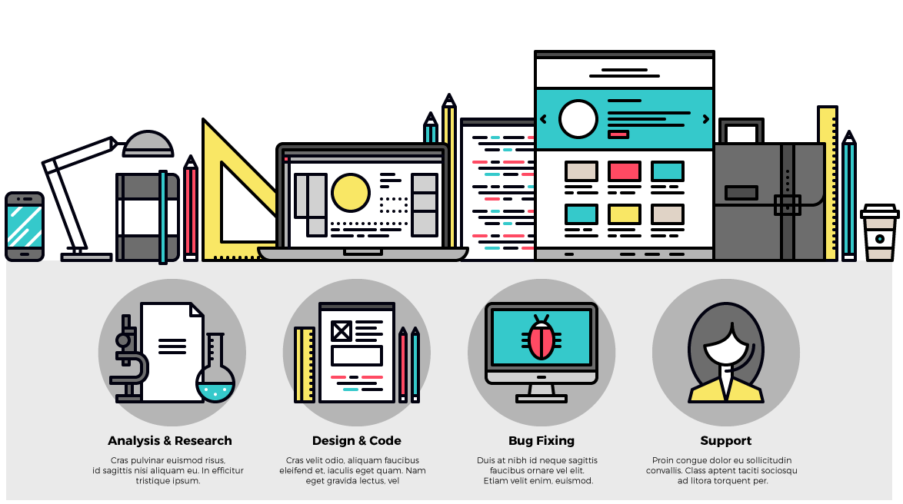

###### Front-End Design CAMP

### Pre Survey

[과정 시작 전, 사전 조사](http://goo.gl/forms/5UMcSc9wIPcnDGBJ3)

-

### 프론트엔드 디자인 CAMP

본 과정에서는 **GOOD DESIGN** 방법론을 기반으로 하여 모던 웹 사이트를 제작해봅니다. 디자인 이론에 충실한 실전 방법론을 통해 설득력있고 논리적인 웹 사이트를 디자인한 후, 프론트엔드 웹 언어(`HTML`/`CSS`)로 구성된 페이지를 만들어가는 과정을 공부하게 됩니다. 디자인부터 제작까지 단언컨데 매우 흥미로운 여정이 될 것입니다!

#### 디자이너의, 디자이너를 위한, 디자이너에 의한

디자인 발상, 기획, 그리고 기획서에 표현된 디자인을 직접 코드로 구현하기 위해 어떤 지식이 필요한지 전적으로 디자이너의 입장에서 전달합니다. 디자이너 출신의 프론트엔드 개발자 야무님의 알토란 같은 노하우를 모조리 가져가세요.

#### 포트폴리오, 결과물이 나올 수밖에 없는 실습위주 강의

하나의 웹 페이지가 제작되기까지 전 과정을 커리큘럼에 그대로 녹여냈습니다. 웹디자인 방법론(타이포그래피, 그리드시스템, 황금분할)에서 시작하여 PSD디자인 시안을 HTML/CSS 웹사이트로 제작하는 실습까지 10주간 진행합니다.

[**GOOD DESIGN** 방법론 `타이포그래피`×`모듈러 스케일`×`버티컬 리듬`×`그리드 시스템`×`황금 비율`](REFERENCE.md)

# Agenda

### 1. 웹디자인 워크플로우

- 웹 디자인에 최적화된 환경 설정
- 웹 타이포그래피
- 웹 그리드 시스템
- 반응형 웹 디자인
- 이미지 / 스프라이트 이미지
- 이미지 슬라이싱 / 제너레이터
- 웹 디자인 포트폴리오

### 2. 스케치/와이어프레임

- 스케치
- 와이어프레임
- 프로토타입 제작

### 3. 프론트엔드 디자인 워크플로우

- 웹 표준
- 웹 접근성
- HTML5 마크업
- CSS3 스타일
- Git 버전 관리

### 4. 포트폴리오 제작 실습

- 포트폴리오 제작 실습

---

[Front-End Design CAMP, FastCampus](http://www.fastcampus.co.kr/dev_camp_dfep/) / [yamoo9.net](http://yamoo9.net).
